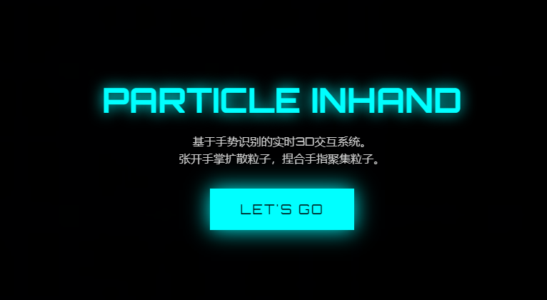
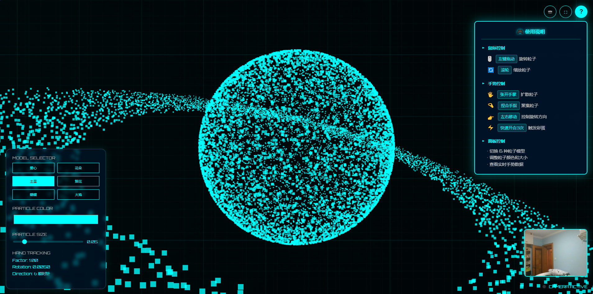

# 🤖 PARTICLE INHAND

<div align="center">

**Real-time 3D Interactive Particle System Based on Gesture Recognition**  
*Open your palm to spread particles, pinch fingers to gather particles*

[](LICENSE) 
[](https://developer.mozilla.org/en-US/docs/Web/JavaScript) 
[](https://threejs.org/) 
[](https://mediapipe.dev/solutions/hands)

🇺🇸 [English](README-en.md) • 🇨🇳 [简体中文](README.md)

<br>

[🚀 Quick Start](#quick-start) • [📖 User Guide](#user-guide) • [🎯 Features](#features) • [🛠️ Technology Stack](#technology-stack) • [🎨 Visual Design](#visual-design)

</div>

---

## ✨ Project Introduction

**Particle Inhand** is a 3D particle interaction system that combines computer vision technology and 3D rendering technology. Through MediaPipe gesture recognition, users can control the behavior of 15,000 particles in real-time with gestures, creating stunning visual effects.

This project demonstrates how to combine AI gesture recognition technology with 3D graphics rendering technology to create immersive user interaction experiences.

---

## 🎬 Screenshots

<div align="center">

### 🖥️ Main Interface

<em>Main interface showing particle controls and gesture recognition status</em>

### ✨ Particle Animation Effect

<em>Real-time particle animation with gesture control effect</em>

</div>

---

## 👁️ Live Preview

<div align="center">

<a href="https://1ecbd82c.pinit.eth.limo/" target="_blank" rel="noopener noreferrer">
  
</a>

<br>

**Click the button above to experience the magic of gesture-controlled 3D particles!**

</div>

---

## 🚀 Quick Start

### System Requirements

| Requirement | Description |
|-------------|-------------|
| **Browser** | Chrome 88+, Firefox 85+, Safari 14+ |
| **Hardware** | Modern graphics card supporting WebGL |
| **Permissions** | Camera access (for gesture recognition) |
| **Network** | HTTPS or localhost environment |

### Run the Project

```bash
# Method 1: Open directly in browser
# Double-click index.html or drag to browser window

# Method 2: Use local server (Recommended)
# Python 3
python -m http.server 8000

# Node.js (need to install http-server)
npx http-server

# Then visit http://localhost:8000 in browser
```

---

## 📖 User Guide

### Gesture Control

| Gesture | Effect | Icon |
|---------|--------|------|
| 🖐️ Open Palm | Spread particles | 🔄 |
| 🤏 Pinch Fingers | Gather particles | 🎯 |
| 👉 Move Left/Right | Control rotation direction | ↻ |
| ⚡ Quick Open/Close 3 Times | Trigger easter egg effect | 🎉 |

### Mouse Control

- **Left Drag**: Rotate particle view
- **Scroll Wheel**: Zoom particle size

### Panel Control

- **Model Selection**: Switch between 6 particle shapes
- **Color Adjustment**: Real-time particle color adjustment
- **Size Adjustment**: Control particle size (0.01-0.3)

---

## 🎯 Features

### ✨ Core Features

- ✋ **Gesture Control** - Real-time MediaPipe gesture tracking, particles respond dynamically to gestures
- 🎨 **6 Particle Models** - Heart, Saturn, Flower, Fireworks, Butterfly, Flame
- 🚀 **High-Performance Rendering** - 60fps smooth operation of 15,000 particles
- 🌟 **Sci-fi Visual Effects** - Futuristic UI design, stunning light and shadow effects
- 🎮 **Multi-mode Control** - Support for gesture, mouse and panel control

### 📦 Particle Models

| Model | Description |
|-------|-------------|
| ❤️ Heart | Heart-shaped parametric equation |
| 🪐 Saturn | Sphere + rotating ring |
| 🌸 Flower | Rose curve equation |
| 🎆 Fireworks | Spherical explosion effect |
| 🦋 Butterfly | Butterfly curve |
| 🔥 Flame | Bottom-dense diffusion |

### ⚡ Technical Highlights

- **Real-time Gesture Recognition**: High-performance gesture tracking based on MediaPipe
- **Smooth Animation**: 60fps rendering of 15,000 particles
- **Modular Architecture**: Clear code structure, easy to extend
- **Responsive Design**: Adaptable to different screen sizes
- **Rich Interactive Experience**: Support for multiple control methods and easter egg effects

---

## 🛠️ Technology Stack

| Category | Technology | Usage |
|----------|------------|-------|
| **Frontend Development** | HTML5/CSS3 | Page structure and styling |
| **Programming Language** | JavaScript (ES6+) | Interactive logic and business implementation |
| **3D Rendering** | Three.js r128 | High-performance 3D graphics rendering |
| **Computer Vision** | MediaPipe Hands API | Real-time gesture recognition |
| **Style Design** | Custom CSS | Sci-fi themed UI design |
| **Font** | Orbitron (Google Fonts) | Tech-inspired font |

---

## 🎨 Visual Design

### Sci-fi Theme

- **Color Scheme**: Cyan (#00FFFF) tech-inspired color palette
- **Background Effect**: 3D cosmic grid + dynamic glow
- **Animation Effect**: Smooth particle transition animations
- **UI Design**: Futuristic control panel

### Performance Optimization

- **LOD System**: Distance culling optimization
- **Memory Management**: Efficient object lifecycle
- **Rendering Optimization**: Throttling and debouncing techniques

---

## 🔧 Development and Deployment

### Development Environment

1. **Clone the Project**
   ```bash
   git clone https://github.com/oscarwang164/particle-inhand.git
   cd particle-inhand
   ```

2. **Development Method**
   - Directly edit the `index.html` file
   - Use modern browser developer tools for debugging
   - No build tools required, changes can be viewed in browser immediately

### Deployment Instructions

This is a pure frontend project, no backend service is needed, and it can be deployed in the following ways:

1. **Local Deployment**:
   ```bash
   # Start local server with Python
   python -m http.server 8000
   
   # Or use Node.js
   npx http-server
   ```

2. **Production Deployment**:
   - Upload all static files to any web server
   - Support GitHub Pages, Vercel, Netlify and other static website hosting services
   - Ensure the server supports HTTPS (camera access requires secure connection)

---

## 📄 License

This project is licensed under the MIT License - see the [LICENSE](LICENSE) file for details

---

## 🙏 Acknowledgments

- [Three.js](https://threejs.org/) - Powerful 3D rendering engine
- [MediaPipe](https://mediapipe.dev/) - Google's machine learning framework
- [Google Fonts](https://fonts.google.com/) - High-quality font resources

---

## 📞 Contact

- **Project Maintainer**: Oscar Wang
- **Email**: [164938@qq.com](mailto:164938@qq.com)
- **GitHub**: [@oscarwang164](https://github.com/oscarwang164)

---

## 🤝 Contribution Guide

Contributions to this project are welcome! Whether you submit bug reports, suggest new features, or directly submit code, we are very welcome.

### How to Contribute

1. **Submit an Issue**: If you find a bug or have a new feature suggestion, please submit an Issue on GitHub
2. **Fork the Project**: Click the "Fork" button in the upper right corner to fork the project to your GitHub account
3. **Create a Branch**: Create a new branch in your Fork to develop new features or fix bugs
4. **Submit a PR**: After completing development, submit a Pull Request to the main branch

### Contribution Guidelines

- Keep code style consistent
- Add necessary comments for new features
- Ensure all modifications are tested
- Clearly describe the changes when submitting PR

---

## 📊 Project Status

- **Current Version**: 1.0.0
- **Development Status**: Maintained
- **Last Update**: 2026-01-09

---

<div align="center">

**🎉 Enjoy the wonderful experience of gesture-controlled 3D particles!**

⭐ If this project helps you, please give it a star!

</div>